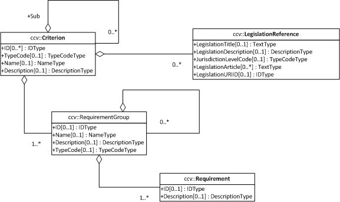

:jaxb: https://jaxb.java.net[JAXB]

== Data model

The ESPD-EDM model was designed to implement the data requirements expressed in the `Annex 2` of the `COMMISSION IMPLEMENTING
REGULATION (EU) 2016/7 of 5 January 2016`, establishing the standard form for the `European Single Procurement Document`.
Additionally to these requirements, the model also took into account the `Information Requirements Model` specified in the
http://www.cenbii.eu/[CEN/BII-Workshops] (namely Workshop 3), and the latest developments relating to the `Virtual Company
Dossier (VCD)` in http://www.esens.eu/[e-Sens].

=== The ESPD Request XML document overview

The UML Diagram below provides a simplified view of the `ESPD Request` document. Notice that the classes herein represented
belong to 4 different data-packages. Consequently, each class name is preceded by one of the following prefixes representing
different namespaces: `espd`, `ccv`, `cev`, and `cac`.

[[img-espd-request]]
image::images/espd_request.png[title="espd::ESPDRequest UML class diagram", alt="espd::ESPDRequest UML class diagram"]

The figure above provides a high level view of the main concepts used in the ESPD Request relating to the `Criterion`
entity. The UML diagram below, in turn, shows in detail the classes and attributes of the Core Criterion Data Model
used in the `ESPD Request` XML document.

[[img-criterion]]

The UML diagram can be read as follows:

* One Criterion contains one or more Groups of Requirements
* One Criterion MAY have sub-Criteria
* One Criterion MAY be linked to a specific Legislation.
* One Group of Requirements contains one or more Requirements

In the ESPD documents a `Criterion` takes the form of
____
a question or statement about a specific subject that may lead to the exclusion or selection of an `Economic Operator`
in a `Procurement Project`.
____
Thus, in the case of grounds for exclusion related to possible convictions, the question
____
Has the economic operator itself or any person who is a member of its
administrative, management or supervisory body or has powers of representation, decision or control therein been the
subject of a conviction by final judgement for participation in a criminal organisation, by a conviction rendered at the
most five years ago or in which an exclusion period set out directly in the conviction continues to be applicable?
____
is to be considered a `Criterion`.

`Requirements`, on the other hand, relates to the way the `Economic Operator` has to answer one specific `Criterion`.
In the case of the exclusion `Criterion` mentioned above, the `Contracting Authority` requires the `Economic Operator (EO)`
to answer `YES` or `NO`, and if the `EO` answers `YES`, he is further required to provide additional details about
the conviction.

=== Java packages

The `exchange-model` Maven module contains the XML schemas used to generate the {jaxb} annotated Java classes.
In the `bindings.xjb` configuration file we want to specify the desired XML namespace prefixes for the entities involved
in the generation of `ESPD-Request` or `ESPD-Response` entities.

[source,xml]
.bindings.xjb
----
<jxb:bindings schemaLocation="ESPDRequest-1.0.xsd">
	<jxb:bindings>
		<namespace:prefix name="espd-req"/>
	</jxb:bindings>
</jxb:bindings>
<jxb:bindings schemaLocation="ESPDResponse-1.0.xsd">
	<jxb:bindings>
		<namespace:prefix name="espd"/>
	</jxb:bindings>
</jxb:bindings>
----

The {jaxb} POJOs are generated by the https://java.net/projects/maven-jaxb2-plugin/pages/Home[JAXB2 Maven plugin]. The plugin configuration
resides in the `exchange-mode/pom.xml` file and the generated Java files are stored in the `src/main/generated` folder that
must be available on the classpath. The plugin will add `toString`, `hashCode`, `equals` methods to the Java classes and
also customize the XML namespace prefixes provided in the sample above.